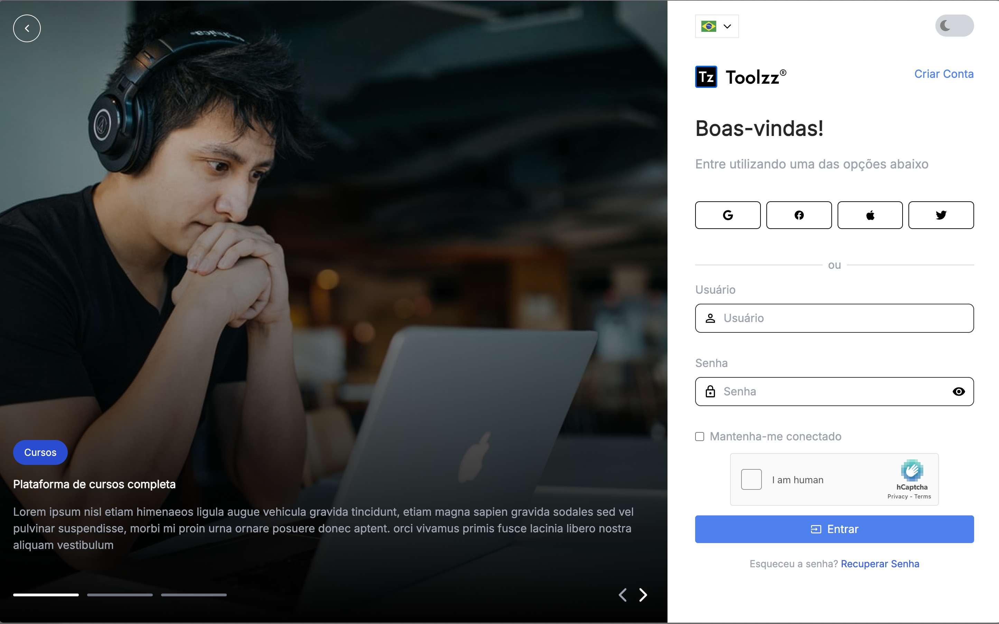

<p align="center">
  <h3 align="center">Login</h3>
  <div align="center">
    
  </div>
</p>

## 📘 Sobre o Projeto

Este projeto é uma aplicação web de login responsivo, desenvolvido com React Js e TypeScript. O layout foi criado no Figma e a aplicação foi desenvolvida com base no layout fornecido.

## 🎨 Layout

O layout foi cuidadosamente projetado para oferecer uma excelente experiência ao usuário. O layout foi criado no Figma e pode ser acessado através do link abaixo:

- [Acessar Layout no Figma]()

## 💻 Tecnologias e Bibliotecas

Este projeto foi desenvolvido utilizando-se das seguintes tecnologias e bibliotecas:

- TypeScript
- React Js
- Vite
- React Query
- React Toastify
- React I18next
- React Loading Skeleton
- Framer Motion

## 🚧 Pré-requisitos

Para rodar este projeto, você precisará de:

- Node.js (versão 14.0 ou superior)
- Git
- npm (ou yarn, se preferir)

## 🛠️ Instalação

Siga estes passos para configurar o projeto localmente:

1. **Clonar o Repositório:**

   ```bash
   git clone https://github.com/billyfranklim1/react-login.git
   cd react-login
   ```

2. **Instalar Dependências:**

   ```bash
   npm install
   ```

3. **Configurar Variáveis de Ambiente:**
   Renomeie o arquivo `.env.example` para `.env` e ajuste as variáveis conforme necessário.

   ```bash
   NEXT_PUBLIC_API_URL=https://localhost:3001
   ```

4. **Iniciar o Projeto:**
   ```bash
   npm run dev
   ```
   Acesse `http://localhost:3000` para visualizar a aplicação.

## 🌐 Demonstração

Para uma visualização rápida, acesse a aplicação demo através deste [link](). Lembre-se de que esta é uma versão de demonstração que pode não refletir totalmente as funcionalidades do projeto.

## 🤝 Como Contribuir

Sua contribuição é bem-vinda! Se você tiver sugestões para melhorar este projeto, sinta-se à vontade para fazer um fork do repositório, realizar as mudanças e criar um pull request. Seu feedback é muito valioso.

## 📜 Licença

Este projeto está sob licença MIT. Veja o arquivo [LICENSE](LICENSE) para mais detalhes.

<p align="center">Desenvolvido tomando ☕ por Billyfranklim 🚀</p>
